# 发卡站项目计划

## 1. 业务逻辑与模块划分

我们将发卡站的核心功能划分为以下四个独立的业务模块：

- **充值卡模块 (`card`)**: 管理员对充值卡的 CRUD 操作。
- **销售模块 (`sale`)**: 用户前台购买充值卡，并通过邮件接收卡密。
- **卡密模块 (`activation_code`)**: 存储和管理每一个具体的卡密及其状态（是否已使用）。
- **订单模块 (`order`)**: 用于外部服务核销卡密，并由内部员工处理后续订单。

## 2. 数据流设计 (Data Flow)

```mermaid
graph TD
    subgraph "管理员后台"
        Admin(管理员) -->|登录| AuthAPI[Auth API: /api/auth/login]
        Admin -->|管理充值卡| CardAPI[Card API: /api/cards]
        CardAPI --> CardService[Card Service]
        CardService --> CardDAO[Card DAO]
        CardDAO --> D1(充值卡 Card 表)
        
        Admin -->|查看/生成卡密| ActivationCodeAPI[ActivationCode API]
        ActivationCodeAPI --> ActivationCodeService[ActivationCode Service]
        ActivationCodeService --> ActivationCodeDAO[ActivationCode DAO]
        ActivationCodeDAO --> D2(卡密 ActivationCode 表)
    end

    subgraph "用户购买流程"
        User(购买者) -->|输入邮箱, 选择卡种| SaleUI(购买页面)
        SaleUI -->|请求购买| SaleAPI[Sale API: /api/sales/purchase]
        SaleAPI --> SaleService[Sale Service]
        SaleService -->|1. 查找可用卡密| ActivationCodeService
        ActivationCodeService -->|2. 返回卡密| SaleService
        SaleService -->|3. 发送邮件| EmailUtil(邮件服务)
        EmailUtil -->|4. 卡密发送至| UserEmail[用户邮箱]
        SaleService -->|5. 记录销售| SaleDAO[Sale DAO]
        SaleDAO --> D3(销售记录 Sale 表)
    end
    
    subgraph "外部服务核销流程"
        ExternalService(外部应用/服务) -->|提交卡密核销| OrderAPI_Verify[Order API: /api/orders/verify]
        OrderAPI_Verify --> OrderService_Verify[Order Service: 核销]
        OrderService_Verify -->|1. 验证卡密| ActivationCodeService
        ActivationCodeService -->|2. 卡密有效, 标记为已使用| OrderService_Verify
        OrderService_Verify -->|3. 创建待处理订单| OrderDAO[Order DAO]
        OrderDAO --> D4(订单 Order 表)
    end

    subgraph "内部员工处理订单"
        Staff(工作人员) -->|登录| AuthAPI
        Staff -->|访问订单页| OrderUI(订单处理页面)
        OrderUI -->|请求订单列表| OrderAPI_List[Order API: /api/orders]
        OrderAPI_List --> OrderService_List[Order Service: 查询]
        OrderService_List --> OrderDAO
        Staff -->|点击“完成”| OrderAPI_Complete[Order API: /api/orders/&#123;id&#125;/complete]
        OrderAPI_Complete --> OrderService_Complete[Order Service: 完成]
        OrderService_Complete --> OrderDAO
    end

```

## 3. 数据模型设计

注：不使用外键

### 充值卡 (`Card`)
- **SQLAlchemy Model**: `src/server/card/models.py`
- **Pydantic Schema**: `src/server/card/schemas.py`
  - `id`: `int` (主键)
  - `name`: `str`
  - `description`: `str`
  - `price`: `float`
  - `is_active`: `bool`

### 卡密 (`ActivationCode`)
- **SQLAlchemy Model**: `src/server/activation_code/models.py`
- **Pydantic Schema**: `src/server/activation_code/schemas.py`
  - `id`: `int` (主键)
  - `card_id`: `int`  **(应用层关联至 `Card.id`)**
  - `code`: `str`
  - `is_used`: `bool`
  - `created_at`: `datetime`
  - `used_at`: `Optional[datetime]`

### 销售记录 (`Sale`)
- **SQLAlchemy Model**: `src/server/sale/models.py`
- **Pydantic Schema**: `src/server/sale/schemas.py`
  - `id`: `int` (主键)
  - `activation_code_id`: `int`  **(应用层关联至 `ActivationCode.id`)**
  - `user_email`: `str`
  - `sale_price`: `float`
  - `purchased_at`: `datetime`

### 订单 (`Order`)
- **SQLAlchemy Model**: `src/server/order/models.py`
- **Pydantic Schema**: `src/server/order/schemas.py`
  - `id`: `int` (主键)
  - `activation_code_id`: `int`  **(应用层关联至 `ActivationCode.id`)**
  - `status`: `str` (枚举: "pending", "completed")
  - `created_at`: `datetime`
  - `completed_at`: `Optional[datetime]`
  - `remarks`: `Optional[str]`